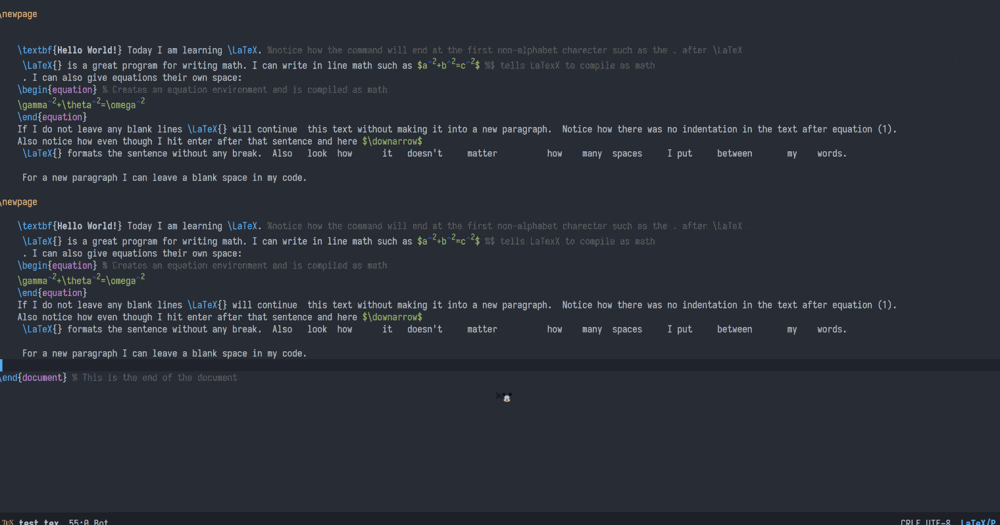

### EAF PDF Viewer

<p align="center">
  
</p>

PDF Viewer application for the [Emacs Application Framework](https://github.com/emacs-eaf/emacs-application-framework).

### Load application
[Install EAF](https://github.com/emacs-eaf/emacs-application-framework#install) first, then add below code in your emacs config:

```Elisp
(add-to-list 'load-path "~/.emacs.d/site-lisp/emacs-application-framework/")
(require 'eaf)
(require 'eaf-pdf-viewer)
```

### LaTeX config

```Elisp
(add-to-list 'TeX-command-list '("XeLaTeX" "%`xelatex --synctex=1%(mode)%' %t" TeX-run-TeX nil t))
(add-to-list 'TeX-view-program-list '("eaf" eaf-pdf-synctex-forward-view))
(add-to-list 'TeX-view-program-selection '(output-pdf "eaf"))

```

Double click the left button to edit backward.

<p align="center">
  
</p>

### Dark mode
Default set background color to `emacs-background-color`

Override this behavior
```
(setq eaf-pdf-dark-mode nil)
```


### Dependency List

| Package        | Description              |
| :--------      | :------                  |
| python-pymupdf | PDF rendering engine     |
| libreoffice    | Convert doc file to pdf, optional |

### The keybinding of EAF PDF Viewer.

| Key   | Event   |
| :---- | :------ |
| `j` | scroll_up |
| `<down>` | scroll_up |
| `C-n` | scroll_up |
| `k` | scroll_down |
| `<up>` | scroll_down |
| `C-p` | scroll_down |
| `h` | scroll_left |
| `<left>` | scroll_left |
| `C-b` | scroll_left |
| `l` | scroll_right |
| `<right>` | scroll_right |
| `C-f` | scroll_right |
| `SPC` | scroll_up_page |
| `b` | scroll_down_page |
| `C-v` | scroll_up_page |
| `M-v` | scroll_down_page |
| `t` | toggle_read_mode |
| `0` | zoom_reset |
| `=` | zoom_in |
| `-` | zoom_out |
| `g` | scroll_to_begin |
| `G` | scroll_to_end |
| `p` | jump_to_page |
| `P` | jump_to_percent |
| `[` | save_current_pos |
| `]` | jump_to_saved_pos |
| `i` | toggle_inverted_mode |
| `C-i` | toggle_inverted_image_mode |
| `m` | toggle_mark_link |
| `f` | jump_to_link |
| `M-w` | copy_select |
| `C-s` | search_text_forward |
| `C-r` | search_text_backward |
| `x` | close_buffer |
| `z` | eaf-ocr-buffer |
| `C-<right>` | rotate_clockwise |
| `C-<left>` | rotate_counterclockwise |
| `M-h` | add_annot_highlight |
| `M-u` | add_annot_underline |
| `M-s` | add_annot_squiggly |
| `M-d` | add_annot_strikeout_or_delete_annot |
| `M-e` | add_annot_text_or_edit_annot |
| `M-p` | toggle_presentation_mode |
| `J` | select_left_tab |
| `K` | select_right_tab |
| `o` | eaf-pdf-outline |
| `O` | eaf-pdf-outline-edit |
| `T` | toggle_trim_white_margin |
